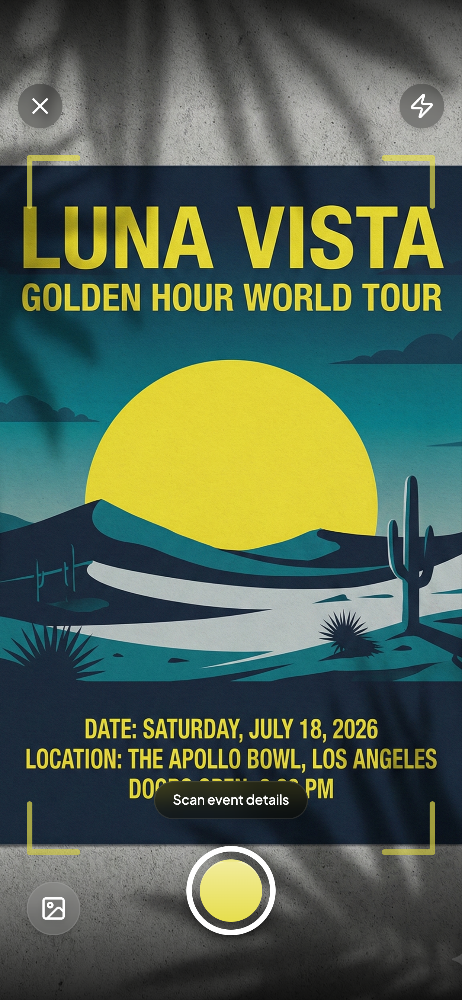
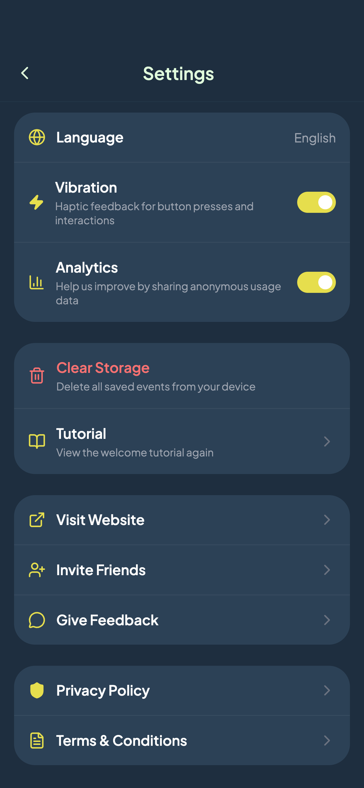

# Cap2Cal

> Snap a photo of any event poster, flyer, or ticket — Cap2Cal extracts the event details using AI and adds them to your calendar. Available on [iOS](https://apps.apple.com/app/cap2cal/id6738043582) and [Android](https://play.google.com/store/apps/details?id=cx.franz.cap2cal).

<div align="center">
  
  
  
  
</div>

## How it works

1. Point your camera at an event poster (or import a photo)
2. AI extracts title, date, time, location and description
3. Export to Google Calendar, Apple Calendar or Outlook with one tap

## Tech Stack

| Layer | Technology |
|-------|-----------|
| **App** | React 18, TypeScript, Vite, TailwindCSS |
| **Native** | Capacitor 7 (iOS + Android) |
| **Backend** | Firebase Cloud Functions, TypeScript |
| **AI** | Google Gemini / Vertex AI |
| **Storage** | Dexie (IndexedDB, local-first) |
| **Analytics** | Firebase Analytics, Crashlytics |
| **Payments** | RevenueCat |
| **Landing Page** | React, Framer Motion, PostHog |

## Project Structure

```
cap2cal/
├── app/                  # Mobile app (React + Capacitor)
│   ├── src/
│   │   ├── pages/        # Screens (Camera, App, Settings, ...)
│   │   ├── components/   # UI components
│   │   ├── services/     # API, analytics, purchases
│   │   ├── hooks/        # Custom hooks (useCapture, useShare, ...)
│   │   ├── contexts/     # Firebase, App context
│   │   ├── db/           # Dexie local database
│   │   └── utils/        # Helpers, logger, i18n
│   └── native/           # iOS & Android native projects
├── backend/              # Firebase Cloud Functions
│   └── functions/src/
│       └── routes/       # analyse, findTickets, featureFlags, ...
├── web/                  # Landing page & marketing site
├── tools/                # Screenshot generation (Puppeteer)
└── docs/                 # Architecture, setup guides, planning
```

## Getting Started

### Prerequisites

- Node.js 22+
- iOS: Xcode 15+ (macOS)
- Android: Android Studio

### Setup

```bash
git clone https://github.com/Franjoo/cap2cal.git
cd cap2cal

# App
cd app
npm install
cp .env.example .env  # fill in your Firebase config + API URLs

# Development (web preview)
npm run dev

# Build & run on device
npm run build
npx cap run ios       # or: npx cap run android
```

### Backend

```bash
cd backend/functions
npm install
# Configure Firebase secrets (Gemini API key, etc.)
firebase deploy --only functions
```

### Landing Page

```bash
cd web
npm install
cp .env.example .env  # fill in Firebase + PostHog config
npm run dev
```

## Features

- **AI event extraction** — Gemini-powered, handles complex posters with multiple events
- **Calendar export** — Google Calendar, Apple Calendar, Outlook, native device calendar
- **Ticket search** — Finds ticket links for detected events via Google Custom Search
- **Event history** — Local-first storage with favorites, filters, and image preview
- **Share** — Export event cards as PDF or image
- **Multi-language** — English, German, Spanish, French, Portuguese, and more
- **Offline-ready** — Events stored locally, synced when online
- **Onboarding** — 3-screen tutorial flow
- **In-app purchases** — Pro subscription via RevenueCat (optional, can be disabled)
- **Feature flags** — Remote config for toggling features server-side
- **Crashlytics** — Error tracking with Firebase Crashlytics

## Architecture

The app follows a **local-first** approach — all event data lives in IndexedDB via Dexie. Firebase is used for auth (anonymous), analytics, remote config, and the backend API. The backend runs on Cloud Functions and uses Vertex AI (Gemini) for image analysis.

Key architectural decisions:

- **No Redux** — React Context + hooks for state management
- **Capacitor over React Native** — Single codebase for web + iOS + Android with web-standard tooling
- **Anonymous auth** — No sign-up friction, user gets a Firebase UID on first launch
- **Local-first storage** — Events persist even without internet, no server-side user data store

See [docs/ARCHITECTURE.md](./docs/ARCHITECTURE.md) for the full system design.

## Documentation

- [Getting Started](./docs/GETTING-STARTED.md) — Setup guide
- [Architecture](./docs/ARCHITECTURE.md) — System design and data flow
- [RevenueCat Setup](./docs/REVENUECAT_SETUP.md) — In-app purchase configuration

## Author

Built by [Franz Benthin](https://github.com/Franjoo).
